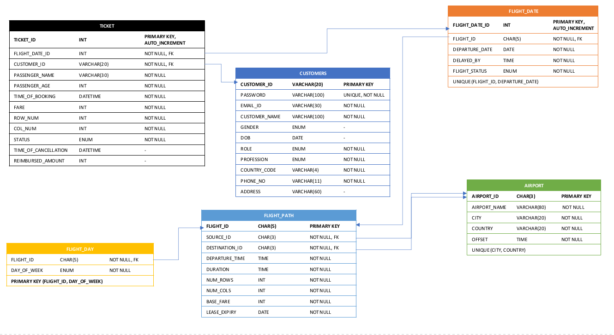

<div align="center">

  
  <h1>KENYA AIRWAYS</h1>
  
  <p>
    
    A flight ticket booking and management application for Kenya AI=irways
    designed and built by Jarvis
  </p>

</div>

<!-- Table of Contents -->

# :notebook_with_decorative_cover: Table of Contents

- [About the Project](#star2-about-the-project)
  - [Screenshots](#camera-screenshots)
  - [Tech Stack](#space_invader-tech-stack)
  - [Features](#dart-features)
  - [Schema](#bricks-schema)
  - [Stored Objects](#bricks-stored-objects)
  - [Environment Variables](#key-environment-variables)
- [Getting Started](#toolbox-getting-started)
  - [Prerequisites](#bangbang-prerequisites)
  - [Setup](#gear-setup)
- [Collaborators](#handshake-collaborators)

<!-- About the Project -->

## :star2: About the Project

<!-- Screenshots -->

### :camera: Screenshots

<div align="center"> 
  </img> </img>  </img> </img> 
  </img> 
    </img> 
  </img> 

</div>

<!-- TechStack -->

### :space_invader: Tech Stack

<details>
  <summary>Client</summary>
  <ul>
    <li><a href="https://mui.com/">MaterialUI</a></li>
    <li><a href="https://reactjs.org/">React.js</a></li>
  </ul>
</details>

<details>
  <summary>Server</summary>
  <ul>
    <li><a href="https://nodejs.org/en/">Node.js</a></li>
    <li><a href="https://expressjs.com/">Express.js</a></li>
  </ul>
</details>

<details>
<summary>Database</summary>
  <ul>
    <li><a href="https://www.mysql.com/">MySQL</a></li>
  </ul>
</details>

<!-- Features -->

### :dart: Features

<details>
<Summary>Customer</summary>
<ul>
<li>View flights between a source and destination for a given date and a window around it</li>
<li>Reserve seat(s) each with a unique id and corresponding passenger details using a seat map for the chosen flight</li>
<li>A ticket will be generated after payment of the fare which is calculated dynamically based on the travel distance, seat preference, profession
of the customer and time gap between booking date and departure date</li>
<li>Customers can view tickets categorized into two categories namely, Upcoming Journeys and Archive</li>
<li>Download tickets as dynamically generated PDFs
Cancel a ticket and receive appropriate refund based on the time gap between cancellation and departure date</li>
<li>View and edit their personal details from their profiles</li>
</ul>
</details>

<details>
<Summary>Admin</summary>
<ul>
<li>Admins have additional permissions to view the enterprise data which includes details about flight routes, their weekly schedules</li>
</ul>
</details>

<details>
<Summary>Super-Admin</summary>
<ul>
<li>Super-Admins have extra privileges that allow them to edit (and read) the enterprise data</li>
<li>Can delay or cancel a flight for a certain date</li>
<li>Can add new flight routes and schedules along with extending the lease date for a certain flight</li>
</ul>
</details>

<details>
<Summary>Additional</summary>
<ul>
<li>As the airline is multinational, the issues that arise due to difference in time zones are taken care of using various
built-in and custom functions</li>
<li>Every change in the database goes through a rigorous check in frontend, backend and the database itself to
ensure that the records are error free</li>
<li>Ticket fares are calculated dynamically based on travel distance, seat preference, profession of the customer and
time gap between booking date and departure date</li>
<li>A record of all flights scheduled in the upcoming 56 days is stored and updated regularly</li>
<li>A seat can be booked again after cancellation by the current holder</li>
</ul>
</details>

<!-- Color Reference -->

### :bricks: Schema

<div align="center">

</div>

### :bricks: Stored Objects

<div align="center">

</div>
<!-- Env Variables -->

### :key: Environment Variables

To run this project, you will need to add the following environment variables to your .env file

`PORT`

`NODE_ENV`

`MYSQL_USER`

`MYSQL_HOST`

`MYSQL_PASSWORD`

`MYSQL_DATABASE`

`JWT_COOKIE_EXPIRES_IN`

`JWT_SECRET`

`JWT_EXPIRES_IN`

<!-- Getting Started -->

## :toolbox: Getting Started

<!-- Prerequisites -->

### :bangbang: Prerequisites

This project uses `npm` as package manager

<!-- Installation -->

### :gear: Setup

Clone the project

```bash
  git clone https://github.com/Ibrah-55/Kenya-Airways-Booking
```

Go to the project directory

```bash
  cd airlineBooking
```

Install server dependencies

```bash
  npm install
```

Install client dependencies

```bash
  npm run install-client
```

Start the server

```bash
  npm run dev
```

Start the client

```bash
  cd client && npm start
```

<!-- Contact -->

## :handshake: Collaborators

- [Ibrah Jarvis](https://github.com/Ibrah-55)

